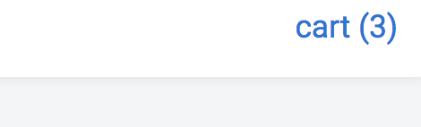

## Redux + Purchase/Cart/Checkout

My submission focuses mainly on the following:
- Refactoring the front-end to use Redux, and
- Provide a full purchase/cart/checkout process for the end user.

The end user will see a 'cart' link in the header on the top right. As expected, when clicking the buy button of each item in the store, that item will be added to the cart. 

In addition to being saved to the redux store, the cart is also copied to Local Storage, which means a user can get back to where they left off between sessions.

After clicking the cart link, it'll take you to the checkout page, where the user will see a list of their items. 

If they click 'purchase', the back-end will first check to make sure the quantities remain in stock before processing the order. A new order is then persisted to the Mongo database, and each purchased product's quantity in the Merchants collections is updated to reflect the new stock.

